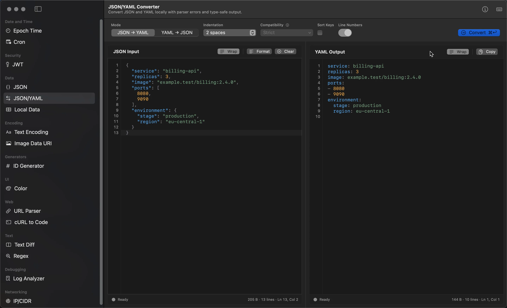

# Dev Workbench

**Developer tools that stay on your Mac.**

Dev Workbench brings 16 focused utilities into one native macOS app. Format
JSON, inspect tokens and URLs, compare text, explore local data, analyze logs,
and handle everyday conversions without sending routine work to a web tool.

[Explore Dev Workbench](https://keloc.app/products/dev-workbench/) ·
[See all workbenches](https://keloc.app/products/dev-workbench/#workbenches) ·
[Read the privacy details](https://keloc.app/products/dev-workbench/privacy/)

## See Dev Workbench In Action

[Watch the overview video](media/dev-workbench-overview.mp4) to see JSON tools,
format conversion, client generation, text comparison, log analysis, and local
data exploration in the app.

## What It Does

- Keeps routine processing local by default, with network access only for
  actions that clearly require it.
- Gives each job a focused native macOS workspace instead of a collection of
  browser tabs.
- Includes nine complete workbenches in Free. Pro adds capabilities to seven
  workbenches, including larger inputs, saved sessions, verification, and
  previews where they apply.
- Runs on macOS 14 or later without requiring an account.

## Find Your Workbench

| Area | Workbenches |
| --- | --- |
| Structured data | [JSON](https://keloc.app/products/dev-workbench/workbenches/json-tools/), [JSON/YAML](https://keloc.app/products/dev-workbench/workbenches/json-yaml/), [Text Encoding](https://keloc.app/products/dev-workbench/workbenches/text-encoding/), [Image Data URI](https://keloc.app/products/dev-workbench/workbenches/image-to-data-uri/) |
| Requests and tokens | [JWT](https://keloc.app/products/dev-workbench/workbenches/jwt/), [cURL to Code](https://keloc.app/products/dev-workbench/workbenches/curl-to-code/), [URL Parser](https://keloc.app/products/dev-workbench/workbenches/url-parser/) |
| Text | [Regex](https://keloc.app/products/dev-workbench/workbenches/regex/), [Text Diff](https://keloc.app/products/dev-workbench/workbenches/text-diff/) |
| Local data | [Local Data](https://keloc.app/products/dev-workbench/workbenches/local-data/), [Log Analyzer](https://keloc.app/products/dev-workbench/workbenches/log-analyzer/) |
| Everyday utilities | [Epoch Time](https://keloc.app/products/dev-workbench/workbenches/epoch-time/), [Cron](https://keloc.app/products/dev-workbench/workbenches/cron-parser/), [ID Generator](https://keloc.app/products/dev-workbench/workbenches/uuid-ulid-generator/), [Color](https://keloc.app/products/dev-workbench/workbenches/color/), [IP/CIDR](https://keloc.app/products/dev-workbench/workbenches/ip-cidr-calculator/) |

Each focused page shows the real app workflow, supported capabilities, and the
boundary between Free and Pro where one applies. Current availability and
release information live on the [product website](https://keloc.app/products/dev-workbench/).

## Help Shape Dev Workbench

This repository is the public support and feedback hub for Dev Workbench. The
application source code is not hosted here.

- [Report a problem](https://github.com/dduraipandian/keloc-dev-workbench/issues/new?template=bug-report.yml)
- [Request a feature](https://github.com/dduraipandian/keloc-dev-workbench/issues/new?template=feature-request.yml)
- [Browse and join existing discussions](https://github.com/dduraipandian/keloc-dev-workbench/issues)
- [Read support and common questions](https://keloc.app/products/dev-workbench/support/)

A useful report includes the workbench, app version and build, macOS version,
the smallest reliable sequence, and what happened instead. A useful feature
request starts with the developer problem and the outcome you need.

> GitHub issues are public. Remove passwords, tokens, private keys,
> authentication headers, purchase receipts, personal information, and private
> workbench content before posting. Use
> [private support](https://keloc.app/products/dev-workbench/support/#report-a-problem)
> when the report cannot be shared publicly.

For App Store billing or refund questions, contact
[Apple Support](https://support.apple.com/billing).
